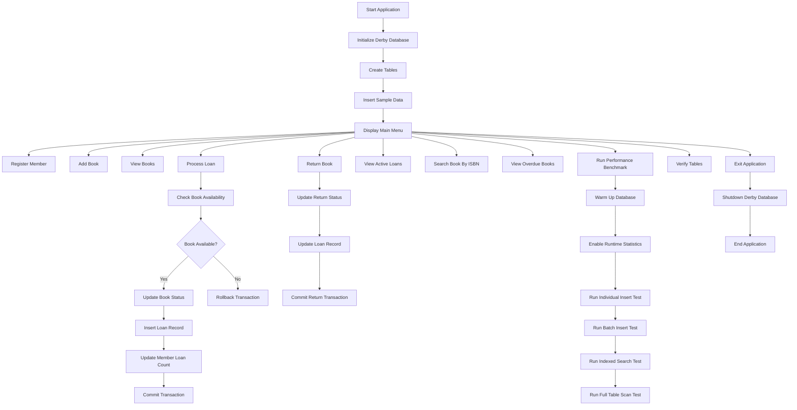

# Library Loan Management System

A console-based JDBC mini project developed using Java and Apache Derby Database.  
This project demonstrates transaction management, JDBC performance evaluation, ACID properties, indexing, benchmarking, and database operations using Derby Embedded Database.

---

# Features

- Member Registration
- Add Books
- Process Book Loans
- Return Books
- Active Loan Tracking
- Overdue Book Detection
- ISBN-Based Search
- Transaction Management
- Savepoints & Rollbacks
- Benchmark Performance Evaluation
- Indexed Query Optimization
- Runtime Statistics
- Derby Database Integration

---

# Technologies Used

- Java
- JDBC
- Apache Derby Database
- Eclipse IDE

---

# Project Structure

```text
src/
 └── SatyanarayanMohanty2341013298/
      ├── MainApp.java
      ├── ConnectionManager.java
      ├── DatabaseInitializer.java
      ├── TransactionService.java
      ├── BusinessLogic.java
      ├── PerformanceEvaluator.java
```

---

# Database Features

* Embedded Derby Database
* Explicit Transaction Handling
* Commit & Rollback
* Savepoints
* Indexed Search
* Runtime Statistics
* Metadata Verification

---

# JDBC Concepts Implemented

* PreparedStatement
* Batch Processing
* Transaction Management
* DatabaseMetaData
* Savepoints
* Exception Handling
* Resource Cleanup
* Performance Benchmarking

---

# Benchmark Tests

The project compares:

* Individual Insert vs Batch Insert
* Indexed Search vs Full Table Scan
* Transaction Performance
* Query Execution Time
* Throughput Analysis

---

# Derby Configuration

Database URL:

```java
jdbc:derby:lab10db;create=true
```

Shutdown URL:

```java
jdbc:derby:lab10db;shutdown=true
```

---

# Required Library

Add the following JAR file to Eclipse Build Path:

```text
derby.jar
```

---

# How To Run

## Step 1

Import project into Eclipse.

## Step 2

Add `derby.jar` to Build Path.

## Step 3

Run:

```text
MainApp.java
```

---

# Sample Menu

```text
1. Register Member
2. Add Book
3. View All Books
4. Process Loan
5. Return Book
6. View Active Loans
7. Search Book By ISBN
8. View Overdue Books
9. Run Performance Benchmark
10. Verify Tables
11. Exit
```
---
# Workflow Diagram



---

# Performance Optimization

* Warm-up phase before benchmarks
* Indexed lookup optimization
* Runtime statistics enabled
* Derby metadata verification

---

# Learning Outcomes

This project demonstrates:

* JDBC Programming
* ACID Transactions
* Database Benchmarking
* Derby Database Management
* Exception Handling
* Query Optimization

---

# Author

Satyanarayan Mohanty

---

# License

This project is licensed under the MIT License.

```
```
